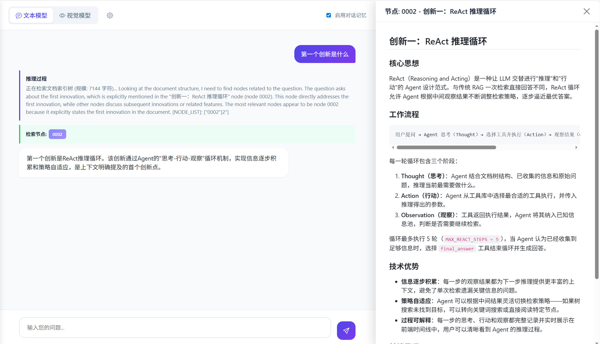

# PageIndex Chat UI

<p align="center">
  <strong>无向量 RAG 解决方案 | 推理式文档检索与智能问答</strong>
</p>

<p align="center">
  <a href="#特性">特性</a> •
  <a href="#快速开始">快速开始</a> •
  <a href="#使用指南">使用指南</a> •
  <a href="#技术架构">技术架构</a> •
  <a href="#致谢">致谢</a>
</p>

---


## 简介

PageIndex Chat UI 是一个基于 [PageIndex](https://github.com/VectifyAI/PageIndex) 开源项目实现的文档问答系统，提供了友好的 Web 聊天界面。本项目采用**无向量 RAG** 技术，通过树状结构推理检索替代传统的向量相似度匹配，实现更精准的文档问答。

## 界面展示




### 核心理念

> **相似度 ≠ 相关性**

传统 RAG 系统依赖向量相似度进行检索，但语义相似的片段未必是回答问题所需的上下文。PageIndex 采用类似 AlphaGo 的树搜索算法，让 LLM 像人类一样"思考"并导航文档结构，精准定位答案来源。


## 特性

### 📄 多格式文档支持
- **PDF 处理**：支持上传 PDF，自动构建分页索引，保留原始排版与层级。
- **Markdown 引擎**：新增原生 Markdown 解析引擎，支持按标题（#、## 等）自动构建索引树，并提供基于 `marked.js` 的精美 HTML 渲染预览。

### 📊 进度可视化
- **实时索引进度**：建立索引时，实时推送“提取文本”、“构建树结构”、“生成摘要”等详细进度。
- **动态日志**：提供可视化进度条及阶段性处理日志，让索引过程不再是“黑盒”。

### 🤖 双模式 RAG
| 模式 | 说明 | 适用场景 |
|------|------|----------|
| **文本模式** | 将页面/章节定义为文本内容进行检索 | 扫描版PDF、文字为主的文档、Markdown |
| **多模态模式** | 将页面定义为图片，使用 VLM 进行检索 | 图表、公式丰富的 PDF 文档 |

### 🎯 精准定位与溯源
- **溯源预览**：点击检索节点，右侧即刻弹出内容预览。PDF 显示原件图片，Markdown 显示渲染后的文档流。
- **自适应侧边栏**：预览侧边栏支持**自由拉伸宽度**，适配不同长宽比的文档阅读。
- **推理过程**：实时流式显示 LLM 的搜索思考路径。

### 💬 智能对话体验
- 流式输出回答
- 多轮对话记忆（可开关）
- 现代化聊天界面，支持自动滚动

## 快速开始

### 环境要求

- Python >= 3.11
- OpenAI API Key 或兼容服务（如 Ollama, DeepSeek 等）

### 安装依赖

```bash
# 使用 pip
pip install -r requirements.txt

# 或使用 uv（推荐）
uv sync
```

### 配置模型

通过 Web 右上角的 **设置按钮（齿轮图标）** 进行配置：

1. **文本模型**：用于树搜索和摘要生成（推荐 `gpt-4o-mini` 或 `qwen2.5-7b`）
2. **多模态模型**：用于视觉模式（需支持图片输入，如 `gpt-4o`）

> **注意**：针对本地模型（如 Ollama），系统已内置上下文自动截断保护（3000 Tokens），防止超出限制。

### 启动服务

```bash
# 直接运行
python app.py
```

服务默认运行在 `http://localhost:8001`

## 使用指南

### 1. 上传文档
- 点击左侧边栏的上传区域。
- 选择 **PDF** 或 **Markdown** 文件。
- 聊天区域将出现进度卡片，显示实时解析进度。

### 2. 交互式问答
- 在下方输入问题。
- 查看“推理过程”了解 AI 如何在文档树中导航。
- 点击出现的“检索节点”查看对应的原文内容。

### 3. 阅读与溯源
- 在右侧弹出的预览窗格中，鼠标悬停至左侧边缘可**左右拖动调整宽度**。
- Markdown 内容会自动渲染为 GitHub 风格的页面，方便阅读。

## 技术架构

```
┌─────────────────────────────────────────────────────────────┐
│                      Frontend (Web UI)                       │
│        Bootstrap + Socket.IO + Marked.js + Github-CSS        │
└─────────────────────────────────────────────────────────────┘
                              │
                              ▼
┌─────────────────────────────────────────────────────────────┐
│                    Backend (Flask + SocketIO)                │
├─────────────────────────────────────────────────────────────┤
│  ┌─────────────┐  ┌─────────────┐  ┌─────────────────────┐  │
│  │   Routes    │  │  Services   │  │      Models         │  │
│  │  - api.py   │  │ - rag_svc   │  │ - document.py       │  │
│  │  - socket   │  │ - indexing  │  │ - document store    │  │
│  └─────────────┘  └─────────────┘  └─────────────────────┘  │
└─────────────────────────────────────────────────────────────┘
                              │
                              ▼
┌─────────────────────────────────────────────────────────────┐
│                    PageIndex Core                            │
│  - Tree Search Algorithm (PDF & Markdown)                    │
│  - Optimized Thinning (Node Merging)                         │
│  - Token-Based Safety Truncation                             │
└─────────────────────────────────────────────────────────────┘
```

## 项目结构

```
pageindex-chat-ui/
├── app.py                 # 应用入口
├── config.py              # 配置管理
├── pageindex/             # 核心逻辑
│   ├── page_index.py      # PDF 索引引擎
│   ├── page_index_md.py   # Markdown 原生引擎
│   └── utils.py           # Token 计算与工具
├── services/
│   ├── rag_service.py     # 聊天与检索编排
│   └── indexing_service.py# 异步索引调度
├── static/
│   └── js/app.js          # 前端交互逻辑
├── templates/
│   └── index.html         # 主界面模板
└── ...
```

## 致谢

本项目核心索引算法参考自 [VectifyAI/PageIndex](https://github.com/VectifyAI/PageIndex) 开源项目。

## License

MIT License

---

<p align="center">
  Made with ❤️ for better document understanding
</p>
